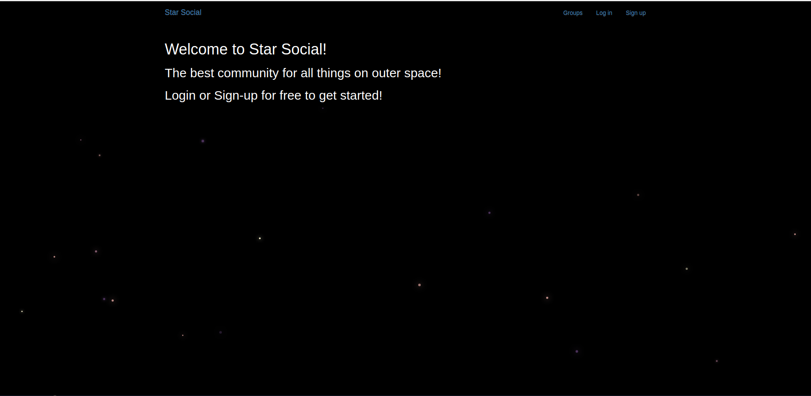
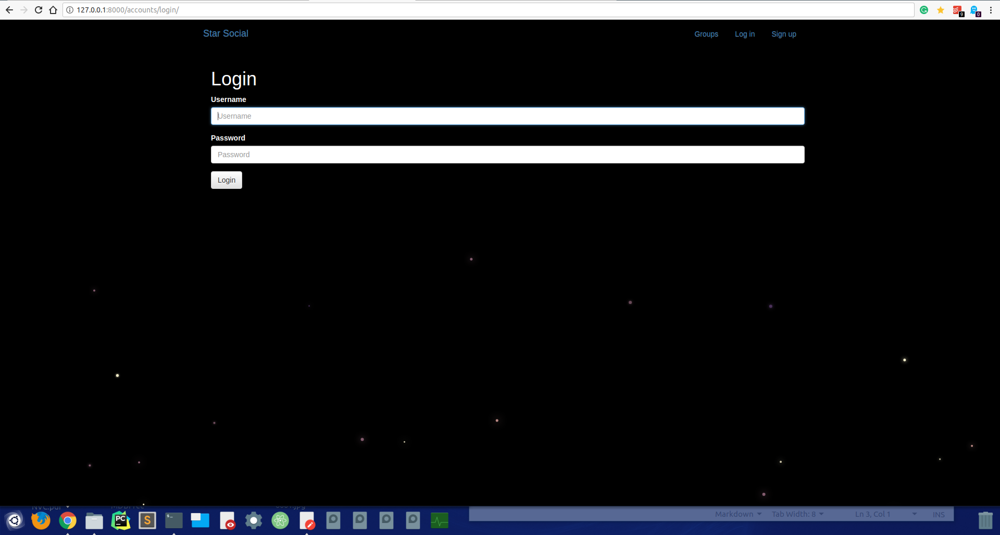
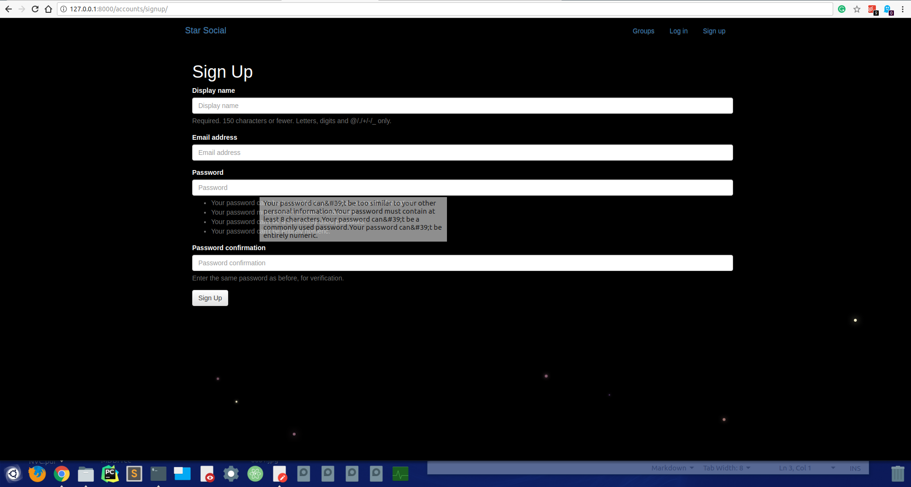
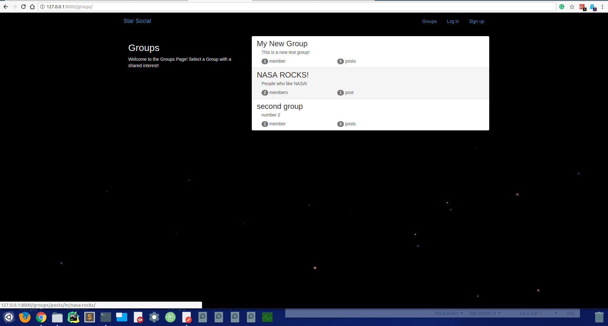
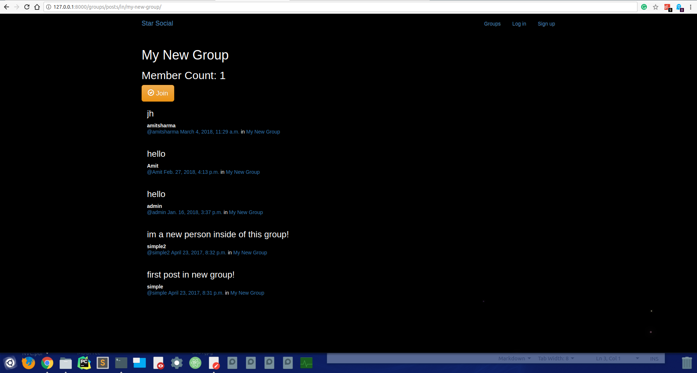
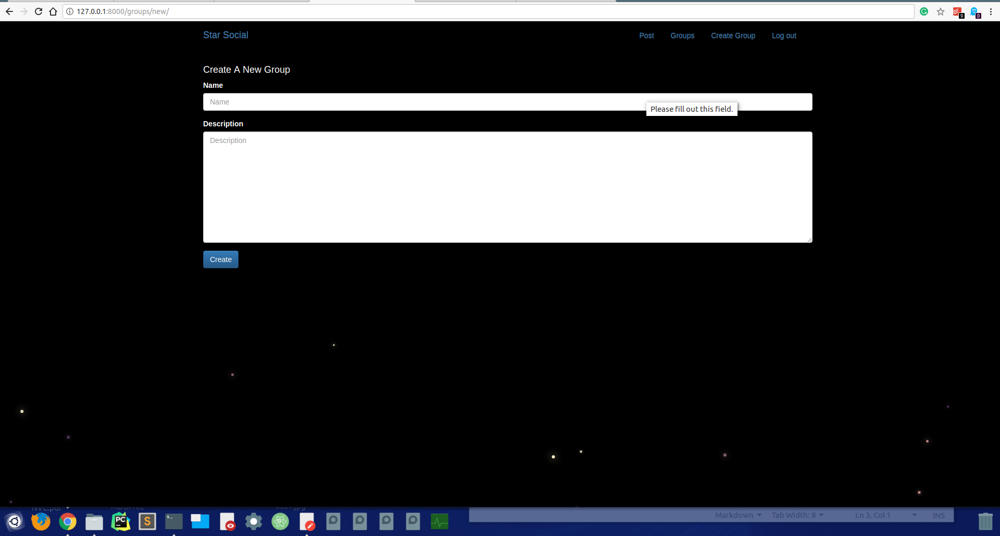
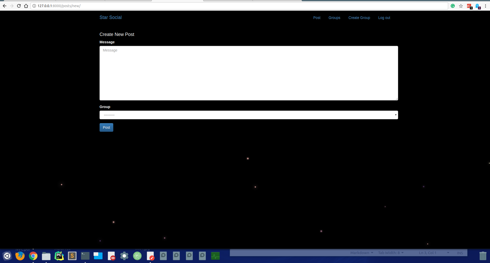
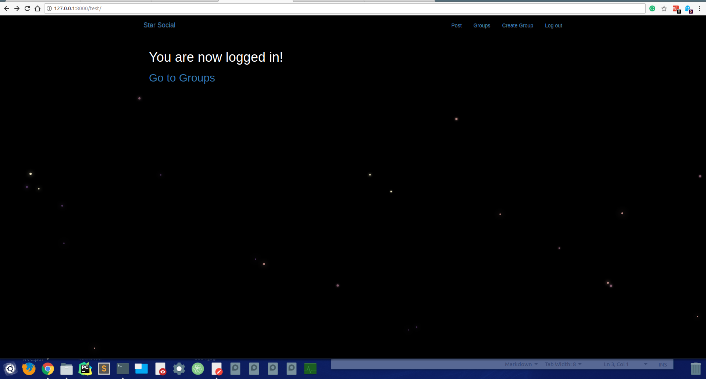

<h1 style="color:red;">Please Checkout The Github Repo. <a href="https://github.com/amit988684/StudentForum">Student Forum</a> which contains the actual main project .. This course learning is used as a subpart of the main big project Student Forum</h1>

<h1>A social media side</h1>
<h3>As a part of udemy course</h3>

<h1>Front</h1>
  

<h1>Login</h1>
  

<h1>Sign Up</h1>
  

<h1>Group Tab</h1>
  

<h1>Inside one of the Group</h1>
  

<h1>Create Group</h1>
  

<h1>Post</h1>
  

<h1>After Login Front</h1>
  
